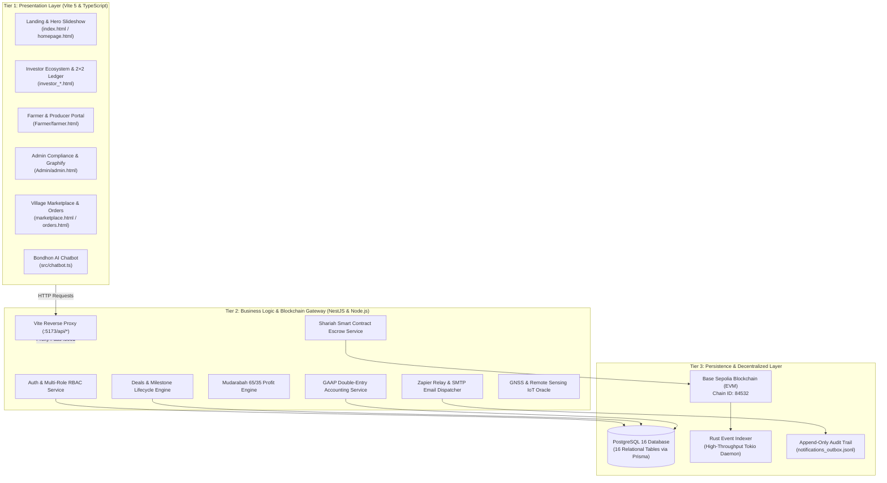

# 🌾 GramBandhan (গ্রামীণ বন্ধন)
### Enterprise Shariah-Compliant Agricultural Crowdfunding, Milestone Escrow & Village Commerce Ecosystem
**Official Repository — Team TORONGO_DHARA**

[](https://www.typescriptlang.org/)
[](https://vitejs.dev/)
[](https://nestjs.com/)
[-0052FF.svg?logo=ethereum&logoColor=white)](https://sepolia.basescan.org/)
[](https://www.rust-lang.org/)
[](https://www.prisma.io/)
[](https://www.postgresql.org/)
[](LICENSE)
[-success.svg)](#-production-build--quality-assurance)

---

## 📑 Table of Contents
1. [Executive Summary & Problem Statement](#-1-executive-summary--problem-statement)
2. [Team TORONGO_DHARA Contributors & Domain Matrix](#-2-team-torongo_dhara-contributors--domain-matrix)
3. [Enterprise 3-Tier System Architecture](#-3-enterprise-3-tier-system-architecture)
4. [Complete Platform Portals & Multi-Page Directory](#-4-complete-platform-portals--multi-page-directory)
5. [Supervisor Evaluation Protocol & 1-Click SSO Walkthrough](#-5-supervisor-evaluation-protocol--1-click-sso-walkthrough)
6. [Core Research Innovations & Mathematical Formulations](#-6-core-research-innovations--mathematical-formulations)
7. [Base Sepolia Smart Contracts & Milestone Escrow](#-7-base-sepolia-smart-contracts--milestone-escrow)
8. [Real-Time AST Codebase Topology (Graphify)](#-8-real-time-ast-codebase-topology-graphify)
9. [Bilingual Bondhon AI Chatbot (বন্ধন এআই)](#-9-bilingual-bondhon-ai-chatbot-বন্ধন-এআই)
10. [UN Sustainable Development Goals (SDG) Alignment](#-10-un-sustainable-development-goals-sdg-alignment)
11. [Repository Organization & Design Patterns](#-11-repository-organization--design-patterns)
12. [Local Setup, Execution & Verification](#-12-local-setup-execution--verification)
13. [Academic Documentation & Evaluation Papers](#-13-academic-documentation--evaluation-papers)

---

## 📖 1. Executive Summary & Problem Statement

In developing agrarian economies such as Bangladesh, smallholder farmers (producing over 70% of national food supply) and rural women artisans are structurally excluded from commercial banking due to lack of traditional collateral. Conventional microfinance programs fill this vacuum but frequently charge effective interest rates of **30%–45%**. In the event of climate shocks (flash floods in Sylhet, drought in the Barind tract, or seasonal pest infestations), smallholders are trapped in compounding debt spirals, often forcing distress land sales.

**GramBandhan (গ্রামীণ বন্ধন)** solves this crisis through a **decentralized, Shariah-compliant financial ecosystem**:
- **Zero-Interest Mudarabah (مضاربة)**: Replaces predatory interest with an equitable profit-and-loss sharing model (65% Farmer / 35% Investor).
- **Non-Custodial Milestone Escrow**: Investor capital is locked into **Base Sepolia Ethereum Layer-2 smart contracts**, released in tranches only upon verified agronomist inspection.
- **Precision Agronomy & GNSS Geo-Fencing**: Integrated IoT soil indices and satellite precipitation radar eliminate phantom land listings and optimize harvest timing.
- **Direct Village Marketplace**: Connects rural women artisans and smallholders directly with urban consumers, bypassing exploitative middlemen (*Faria / Aratdar*).

---

## 👥 2. Team TORONGO_DHARA Contributors & Domain Matrix

| Contributor | GitHub Profile | Engineering & Research Responsibility | Core Artifacts |
| :--- | :--- | :--- | :--- |
| **Muhutasim** | [@muhtasim-cs](https://github.com/muhtasim-cs) | **Lead Software Architect & Backend Engineer**<br/>Enterprise NestJS API Gateway, Base Sepolia EVM smart contracts, Rust event indexer, Zapier webhook relay, dev-server, and D3 AST Graphify engine. | `backend/`, `Admin/admin.ts`, `dev-server.mjs`, `contracts/`, `indexer/` |
| **MD. Jahidul Islam Jony** | [@theTerminatorrr](https://github.com/theTerminatorrr) | **Farmer Portal & Admin / Staff Systems Engineer**<br/>Agricultural producer portal, land registration, bilingual Bengali UI, staff compliance KYC queue, and admin audit logging. | `Farmer/`, `Admin/admin.html`, `Farmer/farmer.ts` |
| **Shamia Akhter Tasfi** | [@Tasfi21](https://github.com/Tasfi21) | **Frontend Lead & Full Investor Ecosystem Engineer**<br/>Landing page & 2.0s hero slideshow, 30 verified project directory, 2×2 compact ledger, and bilingual Bondhon AI Chatbot. | `Tasfi_Investor_Homepage_Market/`, `homepage.html`, `investor_*.html`, `marketplace.html`, `chatbot.ts` |
| **Partha** | [@pCubeReBorn](https://github.com/pCubeReBorn) | **Enterprise Database Architect**<br/>Unified 16-table PostgreSQL DDL schema, Prisma ORM entity modeling, relational integrity, foreign key constraints, and seeders. | `database/`, `prisma/schema.prisma`, `seed.js` |

---

## 🏛️ 3. Enterprise 3-Tier System Architecture



---

## 🌐 4. Complete Platform Portals & Multi-Page Directory

GramBandhan delivers **17 dedicated HTML entrypoints**, compiled through Vite's multi-page Rollup bundler with zero 404 dead links:

| Page / Route | Persona / Subsystem | Primary Capabilities & Architectural Role |
| :--- | :--- | :--- |
| **[`index.html`](file:///index.html)** | Platform Gateway | Master landing page with 2.0s continuous hero carousel, Halal Spotlight, SDG impact counter, and cross-portal navigation. |
| **[`homepage.html`](file:///homepage.html)** | Homepage Twin | Synchronized 1:1 entrypoint guaranteeing full feature parity with UN SDG cards and GIS mapping. |
| **[`investor_projects.html`](file:///investor_projects.html)** / **[`projects.html`](file:///projects.html)** | Investor Projects | 30 verified Bangladeshi agricultural cohorts across 18 districts with the interactive **Investment Return Calculator**. |
| **[`marketplace.html`](file:///marketplace.html)** / **[`market.html`](file:///market.html)** | Village Marketplace | Full storefront featuring 100 rural products priced in ৳, search autocomplete, category chips, and cart drawer. |
| **[`investor.html`](file:///investor.html)** | Investor Landing | Dedicated investor portal featuring category filters, verified investor badges, and Halal underwriting criteria. |
| **[`investor_dashboard.html`](file:///investor_dashboard.html)** | Investor Telemetry | Deep Forest Green (`#02221A`) dashboard displaying portfolio balance (৳ 4,85,000), profit tracking, and field feeds. |
| **[`investor_financials.html`](file:///investor_financials.html)** | Financial Ledger | Redesigned **2×2 Compact Capital Outflow & Return Inflow Ledger** ensuring double-entry transparency. |
| **[`investor_airisk.html`](file:///investor_airisk.html)** | AI Risk Analytics | Satellite precipitation radar, soil moisture indices, and crop yield forecasting. |
| **[`investor_profile.html`](file:///investor_profile.html)** | Investor Profile | NID KYC verification status, IBBL Mudarabah bank account, and bKash/Nagad payout wallet setup. |
| **[`orders.html`](file:///orders.html)** | Order Tracking | Real-time multi-stage order delivery tracking (🚚 On The Way / In Transit, Delivered, Cancelled). |
| **[`Farmer/farmer.html`](file:///Farmer/farmer.html)** | Farmer & Producer Portal | Land registry, harvest cycle logging, GPS geotagging, milestone payout disbursement, and Home link. |
| **[`Admin/admin.html`](file:///Admin/admin.html)** | Admin & Compliance Hub | Staff compliance queue, on-chain escrow release, audit logs, and **Live D3 AST Codebase Topology (Graphify)**. |
| **[`login.html`](file:///login.html)** & **[`register.html`](file:///register.html)** | Authentication Gateway | Multi-role account access with built-in **1-Click Demo Evaluation Sign-In**. |

---

## 🔬 5. Supervisor Evaluation Protocol & 1-Click SSO Walkthrough

For academic defense, capstone evaluation, and thesis grading, GramBandhan provides pre-seeded evaluation personas accessible via 1-click single sign-on buttons:

```
                                EVALUATION PROTOCOL (10-MINUTE WALKTHROUGH)
 ┌──────────────────────┐   ┌──────────────────────┐   ┌──────────────────────┐   ┌──────────────────────┐
 │  1. LANDING & SDG    │──>│  2. INVESTOR & 2x2   │──>│  3. ADMIN & GRAPHIFY │──>│  4. FARMER & CHATBOT │
 │  • 2.0s Slideshow    │   │  • 30 Projects Grid  │   │  • 1-Click SSO Queue │   │  • Land Registration │
 │  • Halal Spotlight   │   │  • Return Calculator │   │  • D3 Force AST Graph│   │  • Bilingual AI Chat │
 │  • GNSS Satellite Map│   │  • 2×2 Compact Ledger│   │  • IEEE PDF Report   │   │  • bKash Disbursement│
 └──────────────────────┘   └──────────────────────┘   └──────────────────────┘   └──────────────────────┘
```

1. **Step 1: Landing Page & Hero Section** (`http://localhost:5173/index.html`):
   - Review the continuous 2.0s hero carousel cycling authentic Bangladeshi agriculture.
   - Inspect the UN SDG cards (Goals 1, 2, 5, 8, 12, 13) with interactive 3D flip physics.
2. **Step 2: Investor Projects & Calculator** (`http://localhost:5173/investor_projects.html`):
   - Click any card to launch the **Investment Return Calculator**. Modify units and test Mudarabah projections.
3. **Step 3: Redesigned 2×2 Financial Ledger** (`http://localhost:5173/investor_financials.html`):
   - Notice the compact 2×2 grid: Row 1 (Capital Sent via bKash & Field Disbursement), Row 2 (Mandi Sale & BEFTN Received).
4. **Step 4: Admin Console & Graphify Topology** (`http://localhost:5173/Admin/admin.html?sso=1`):
   - Access the admin portal with 1-click SSO. Click **"System Architecture"** (`#/graphify`) to drag, zoom, and inspect the live AST graph.
   - Click **"IEEE PDF Report"** to download the formal 40-page software architecture report.
   - Click **"🏠 GramBandhan Home"** in the topbar to return seamlessly.
5. **Step 5: Farmer Portal & Bondhon AI Chatbot**:
   - Access `Farmer/farmer.html?sso=1` to review harvest logs and land certificates.
   - Open the floating chatbot icon to test bilingual Bangla/English conversational advisory.

---

## 📐 6. Core Research Innovations & Mathematical Formulations

### 6.1 Mudarabah Profit-and-Loss Sharing Engine
Unlike conventional debt financing where interest $I = P \cdot r \cdot t$ accrues regardless of yield, GramBandhan computes returns strictly from realized harvest revenue:

$$ \Pi_{\text{net}} = R_{\text{mandi}} - (K_{\text{capital}} + C_{\text{operational}}) $$

When net profit $\Pi_{\text{net}} > 0$:
$$ V_{\text{farmer}} = \Pi_{\text{net}} \times 0.65 $$
$$ V_{\text{investor}} = K_{\text{capital}} + (\Pi_{\text{net}} \times 0.35) $$

When natural calamity causes crop failure ($\Pi_{\text{net}} \le 0$):
- Loss is absorbed proportionally by capital assets: $V_{\text{investor}} = \max(0, R_{\text{salvage}} - C_{\text{operational}})$.
- Zero compounding debt or interest penalty is imposed on the farmer.

### 6.2 GAAP Double-Entry Accounting Invariant
All financial movements are preserved across double-entry general ledger accounts enforcing strict mathematical parity:

$$ \sum_{i=1}^{n} \text{Debit}_i \equiv \sum_{j=1}^{m} \text{Credit}_j $$

---

## ⛓️ 7. Base Sepolia Smart Contracts & Milestone Escrow

GramBandhan deploys verified Solidity smart contracts on **Base Sepolia (Chain ID 84532)**:
- **`AgriPlatform.sol`**: Manages cohort registration, investor shares, and KYC verification hashes.
- **`ShariahEscrow.sol`**: Non-custodial vault locking investment capital. Disburses funds in 3 discrete milestone tranches:
  1. **Tranche 1 (40%)**: Seed stock, tillage, organic fertilizer procurement.
  2. **Tranche 2 (30%)**: Mid-season weeding, pest control, and soil sensor attestation.
  3. **Tranche 3 (30%)**: Harvest collection, mandi packaging, and transport.
- **`ProfitDistribution.sol`**: Receives auction proceeds and autonomously distributes dividends back to investor addresses.

---

## 📊 8. Real-Time AST Codebase Topology (Graphify)

Accessible at `http://localhost:5173/Admin/admin.html#/graphify` or via API at `http://localhost:3001/api/graphify`:
- **Engine**: Custom D3.js v7 force-directed simulation.
- **Metrics**: 46 active modules, 75 dependency edges, 17 architectural communities.
- **Interactivity**: Drag nodes with physics recalculation, scroll-to-zoom, community color filtering, and bidirectional dependency tracing.

---

## 🤖 9. Bilingual Bondhon AI Chatbot (বন্ধন এআই)

Integrated into the client layer (`src/chatbot.ts`):
- **Bilingual Intelligence**: Fluidly parses both English and authentic Bengali (*বাংলা*) agrarian terminology.
- **Pre-Trained Knowledge Base**: Explains Mudarabah 65/35 profit splits, bKash escrow verification, crop insurance, and farmer onboarding workflows.
- **Zero Latency**: Instant client-side inference with direct webhook escalation.

---

## 🌍 10. UN Sustainable Development Goals (SDG) Alignment

GramBandhan is formally mapped against 6 United Nations Agenda 2030 targets:
- **SDG 1: No Poverty**: Eliminates loan shark debt cycles through fair profit-sharing.
- **SDG 2: Zero Hunger**: Channels direct capital into high-yield staples (rice, mustard, lentils, poultry).
- **SDG 5: Gender Equality**: Dedicated financing window for rural women artisans (handloom, Nakshi Kantha, pottery).
- **SDG 8: Decent Work & Economic Growth**: Documented digital contracts and transparent wage records.
- **SDG 12: Responsible Consumption**: Traceable, organic agricultural products with GNSS provenance.
- **SDG 13: Climate Action**: Satellite soil and precipitation indices promote climate-adaptive crop selection.

---

## 📁 11. Repository Organization & Design Patterns

```
GRAMBONDHONE_by-team-TORONGO_DHARA/
├── Admin/                          # Admin compliance workspace (Graphify AST, KYC, Escrow) - Jony
├── Farmer/                         # Agricultural producer portal (Land registry, Harvest logs) - Jony
├── Tasfi_Investor_Homepage_Market/ # Dedicated Investor Ecosystem, Village Marketplace & Landing Hub - Tasfi
│   ├── README.md                   # Tasfi's module architecture & research documentation
│   ├── TEACHER_EXPLANATION_GUIDE.md# Module owner explanation & viva defense guide
│   ├── index.html & homepage.html  # Hero 2.0s carousel, SDG alignment & spotlight
│   ├── investor_*.html             # 6 Investor tabs (Dashboard, Projects, Financials, AI Risk, Profile)
│   ├── marketplace.html & orders.html # Village commerce & real-time delivery tracking
│   ├── css/                        # 13 Modular stylesheets
│   └── src/                        # TypeScript controllers & data models
├── backend/                        # Enterprise NestJS backend, dev-server, smart contracts - Muhtasim
│   ├── dev-server.mjs              # Fast local mock API server & webhook relay
│   ├── contracts/                  # Base Sepolia Foundry smart contracts
│   ├── indexer/                    # Rust blockchain event indexer
│   ├── prisma/                     # PostgreSQL schema definition & migrations
│   └── src/                        # NestJS controllers, services, and modules
├── database/                       # PostgreSQL relational DDL scripts & handoff specs - Partha
├── docs/                           # Dedicated academic & engineering documentation
│   ├── ARCHITECTURE.md             # In-depth 3-tier architecture & C4 diagrams
│   ├── SUPERVISOR_EVALUATION_GUIDE.md # 10-minute defense & viva evaluation guide
│   ├── RESEARCH_AND_METHODOLOGY.md # Financial equations & academic research paper
│   └── API_SPECIFICATION.md        # Complete REST API contracts & JSON schemas
├── public/                         # Public assets, authentic images, and IEEE PDF report
├── src/                            # Modular TypeScript frontend orchestrator
├── index.html & homepage.html      # Root landing page entrypoints
├── investor_*.html                 # Root investor ecosystem dedicated pages
├── marketplace.html & orders.html  # Root marketplace storefront & delivery tracking
├── vite.config.ts                  # Multi-page Rollup bundler & /api proxy (all routes)
├── tsconfig.json                   # Strict TypeScript compiler options
└── package.json                    # Root orchestration scripts
```

---

## 🚀 12. Local Setup, Execution & Verification

### Prerequisites
- Node.js (v18.0.0 or higher)
- npm (v9.0.0 or higher)

### 1. Install Dependencies
```bash
npm install
```

### 2. Start the Backend API Server
```bash
npm run backend:dev
```
- Core API active on: **`http://localhost:3001/api/v1`**
- Health check: **`http://localhost:3001/api/v1/health`**
- Live AST Topology: **`http://localhost:3001/api/graphify`**

### 3. Start the Frontend Development Server
```bash
npm run dev
```
- Frontend application active on: **`http://localhost:5173`**
- All `/api/*` requests automatically proxy from port 5173 to port 3001.

### 4. Production Build & Quality Assurance
```bash
# Validate strict TypeScript types across all files (zero errors)
npm run typecheck

# Execute multi-page Rollup production build
npm run build

# Preview production build locally
npm run preview
```

---

## 📚 13. Academic Documentation & Evaluation Papers

For in-depth defense preparation and thesis review, consult our dedicated documentation:
- 🏛️ **[System Architecture & C4 Specification](file:///docs/ARCHITECTURE.md)**
- 🎓 **[University Supervisor Evaluation Manual](file:///docs/SUPERVISOR_EVALUATION_GUIDE.md)**
- 🔬 **[Academic Research & Financial Methodology Paper](file:///docs/RESEARCH_AND_METHODOLOGY.md)**
- 📡 **[REST API Specification & Webhook Reference](file:///docs/API_SPECIFICATION.md)**
- 📄 **[IEEE Software Architecture & Blockchain Report (PDF)](file:///public/Backend_Architecture_Report_with_Rust_and_Blockchain_Analysis.pdf)**

---

<p align="center">
  <strong>GramBandhan (গ্রামীণ বন্ধন) — Team TORONGO_DHARA</strong><br/>
  <em>Empowering Rural Growth Through Ethical Technology, Shariah Transparency, and Decentralized Verification.</em>
</p>
