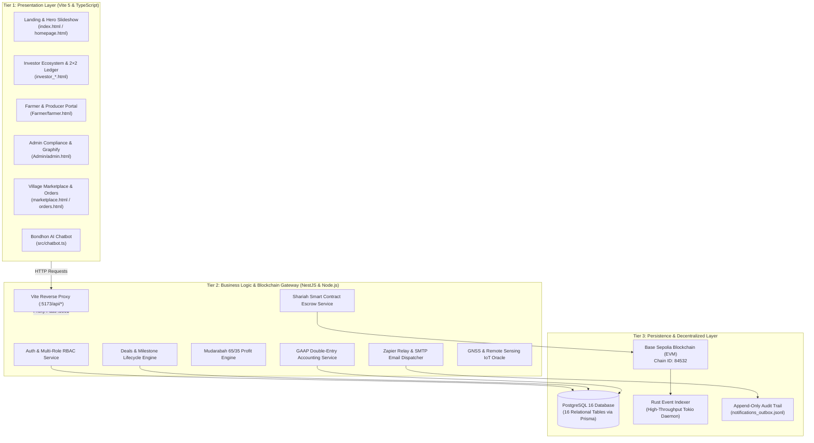

# 🌾 GramBandhan (গ্রামীণ বন্ধন)
### Enterprise Shariah-Compliant Agricultural Crowdfunding, Milestone Escrow & Village Commerce Ecosystem
**Official Repository — Team TORONGO_DHARA**

[](https://www.typescriptlang.org/)
[](https://nestjs.com/)
[-0052FF.svg?logo=ethereum&logoColor=white)](https://sepolia.basescan.org/)
[](https://www.rust-lang.org/)
[](https://www.prisma.io/)
[](https://www.postgresql.org/)
[](LICENSE)
[-success.svg)](#-local-setup-execution--verification)

---

## 📑 Table of Contents
1. [Executive Summary & Problem Statement](#-1-executive-summary--problem-statement)
2. [Team TORONGO_DHARA Contributors & Domain Matrix](#-2-team-torongo_dhara-contributors--domain-matrix)
3. [Enterprise 3-Tier System Architecture](#-3-enterprise-3-tier-system-architecture)
4. [Platform Portals & Multi-Branch Architecture](#-4-platform-portals--multi-branch-architecture)
5. [Supervisor Evaluation Protocol & 1-Click Walkthrough](#-5-supervisor-evaluation-protocol--1-click-walkthrough)
6. [Core Research Innovations & Mathematical Formulations](#-6-core-research-innovations--mathematical-formulations)
7. [Base Sepolia Smart Contracts & Milestone Escrow](#-7-base-sepolia-smart-contracts--milestone-escrow)
8. [Real-Time AST Codebase Topology (Graphify)](#-8-real-time-ast-codebase-topology-graphify)
9. [UN Sustainable Development Goals (SDG) Alignment](#-9-un-sustainable-development-goals-sdg-alignment)
10. [Repository Organization & Design Patterns](#-10-repository-organization--design-patterns)
11. [Local Setup, Execution & Verification](#-11-local-setup-execution--verification)
12. [Academic Documentation & Evaluation Papers](#-12-academic-documentation--evaluation-papers)

---

## 📖 1. Executive Summary & Problem Statement

In developing agrarian economies such as Bangladesh, smallholder farmers (producing over 70% of national food supply) and rural women artisans are structurally excluded from commercial banking due to lack of traditional collateral. Conventional microfinance programs fill this vacuum but frequently charge effective interest rates of **30%–45%**. In the event of climate shocks (flash floods in Sylhet, drought in the Barind tract, or seasonal pest infestations), smallholders are trapped in compounding debt spirals, often forcing distress land sales.

**GramBandhan (গ্রামীণ বন্ধন)** solves this crisis through a **decentralized, Shariah-compliant financial ecosystem**:
- **Zero-Interest Mudarabah (مضاربة)**: Replaces predatory interest with an equitable profit-and-loss sharing model (65% Farmer / 35% Investor).
- **Non-Custodial Milestone Escrow**: Investor capital is locked into **Base Sepolia Ethereum Layer-2 smart contracts**, released in tranches only upon verified agronomist inspection.
- **Precision Agronomy & GNSS Geo-Fencing**: Integrated IoT soil indices and satellite precipitation radar eliminate phantom land listings and optimize harvest timing.
- **Direct Village Marketplace**: Connects rural women artisans and smallholders directly with urban consumers, bypassing exploitative middlemen (*Faria / Aratdar*).

---

## 👥 2. Team TORONGO_DHARA Contributors & Domain Matrix

| Contributor | GitHub Profile | Engineering & Research Responsibility | Dedicated Branch / Artifacts |
| :--- | :--- | :--- | :--- |
| **Muhutasim** | [@muhtasim-cs](https://github.com/muhtasim-cs) | **Lead Software Architect & Backend Engineer**<br/>Enterprise NestJS API Gateway, Base Sepolia EVM smart contracts, Rust event indexer, Zapier webhook relay, mock dev-server, and D3 AST Graphify engine. | `backend/`, `main`, branch [`muhtasim-backend`](https://github.com/muhtasim-cs/GRAMBONDHONE_by-team-TORONGO_DHARA/tree/muhtasim-backend) |
| **MD. Jahidul Islam Jony** | [@theTerminatorrr](https://github.com/theTerminatorrr) | **Farmer Portal & Admin / Staff Systems Engineer**<br/>Agricultural producer portal, land registration, bilingual Bengali UI, staff compliance KYC queue, and admin audit logging. | Branch [`jony-farmer-admin`](https://github.com/muhtasim-cs/GRAMBONDHONE_by-team-TORONGO_DHARA/tree/jony-farmer-admin) (`Farmer/`, `Admin/`) |
| **Shamia Akhter Tasfi** | [@Tasfi21](https://github.com/Tasfi21) | **Frontend Lead & Full Investor Ecosystem Engineer**<br/>Landing page & 2.0s hero slideshow, 30 verified project directory, 2×2 compact ledger, and bilingual Bondhon AI Chatbot. | Branch [`tasfi-investor_homapage_market`](https://github.com/muhtasim-cs/GRAMBONDHONE_by-team-TORONGO_DHARA/tree/tasfi-investor_homapage_market) (`homepage.html`, `investor_*.html`, `marketplace.html`) |
| **Partha** | [@pCubeReBorn](https://github.com/pCubeReBorn) | **Enterprise Database Architect**<br/>Unified 16-table PostgreSQL DDL schema, Prisma ORM entity modeling, relational integrity, foreign key constraints, and seeders. | `database/`, branch [`partha-database`](https://github.com/muhtasim-cs/GRAMBONDHONE_by-team-TORONGO_DHARA/tree/partha-database) |

---

## 🏛️ 3. Enterprise 3-Tier System Architecture



---

## 🌐 4. Platform Portals & Multi-Branch Architecture

Team TORONGO_DHARA maintains a clean separation of concerns across specialized Git branches:

| Subsystem / Portal | Dedicated Branch | Lead Engineer | Architectural Scope |
| :--- | :--- | :--- | :--- |
| **Enterprise Backend & Core Architecture** | [`main`](https://github.com/muhtasim-cs/GRAMBONDHONE_by-team-TORONGO_DHARA) / [`muhtasim-backend`](https://github.com/muhtasim-cs/GRAMBONDHONE_by-team-TORONGO_DHARA/tree/muhtasim-backend) | **Muhutasim** | Enterprise NestJS microservices, Base Sepolia smart contracts (`backend/contracts/`), Rust indexer, dev-server, Zapier webhooks. |
| **Enterprise Database & Relational Schemas** | [`partha-database`](https://github.com/muhtasim-cs/GRAMBONDHONE_by-team-TORONGO_DHARA/tree/partha-database) | **Partha** | 16-table PostgreSQL DDL schema (`database/`), Prisma ORM models, relational integrity, seeders. |
| **Farmer & Admin Compliance Ecosystem** | [`jony-farmer-admin`](https://github.com/muhtasim-cs/GRAMBONDHONE_by-team-TORONGO_DHARA/tree/jony-farmer-admin) | **MD. Jahidul Islam Jony** | Agricultural producer portal (`Farmer/`), land registration, bilingual Bengali UI, staff compliance KYC queue (`Admin/`). |
| **Investor Ecosystem & Village Marketplace** | [`tasfi-investor_homapage_market`](https://github.com/muhtasim-cs/GRAMBONDHONE_by-team-TORONGO_DHARA/tree/tasfi-investor_homapage_market) | **Shamia Akhter Tasfi** | Master landing page (`homepage.html`), 2.0s hero slideshow, 30 verified project directory, 2×2 compact ledger, and village marketplace. |

---

## 🔬 5. Supervisor Evaluation Protocol & 1-Click Walkthrough

For academic defense, capstone evaluation, and thesis grading, GramBandhan provides an evaluation protocol:

```
                                EVALUATION PROTOCOL (MAIN TRUNK & SERVICES)
 ┌──────────────────────┐   ┌──────────────────────┐   ┌──────────────────────┐   ┌──────────────────────┐
 │ 1. REST API GATEWAY  │──>│ 2. SEPOLIA ESCROW    │──>│ 3. GRAPHIFY TOPOLOGY │──>│ 4. RELATIONAL DB     │
 │ • Health Endpoint    │   │ • Milestone Tranches │   │ • D3 AST Force Graph │   │ • 16-Table Schema    │
 │ • Auth JWT & RBAC    │   │ • Non-Custodial Vault│   │ • Module Dependencies│   │ • Prisma Models      │
 │ • Deal Lifecycle     │   │ • 65/35 Profit Math  │   │ • Complexity Metrics │   │ • Referential Rules  │
 └──────────────────────┘   └──────────────────────┘   └──────────────────────┘   └──────────────────────┘
```

1. **Step 1: REST API Gateway & Health Verification** (`http://localhost:3001/api/v1/health`):
   - Start the backend dev-server: `npm run backend:dev`.
   - Access the health endpoint to verify Base Sepolia connection and microservice uptime.
2. **Step 2: Smart Contract & Milestone Escrow Protocol** (`backend/contracts/`):
   - Inspect `ShariahEscrow.sol` and `AgriPlatform.sol` implementing non-custodial milestone releases on Base Sepolia.
3. **Step 3: Real-Time AST Codebase Topology** (`http://localhost:3001/api/graphify`):
   - Live AST graph mapping modules, dependencies, and execution flows.
4. **Step 4: Unified PostgreSQL Schema & Seeders** (`database/`):
   - Inspect `grambandhan_unified_schema.sql` and `database/schema.prisma` enforcing 16-table relational integrity.
5. **Step 5: Frontend Portals on Dedicated Member Branches**:
   - For UI evaluation of Farmer and Admin portals, switch to branch `jony-farmer-admin`.
   - For UI evaluation of Investor ecosystem and Marketplace, switch to branch `tasfi-investor_homapage_market`.

---

## 📐 6. Core Research Innovations & Mathematical Formulations

### 6.1 Mudarabah Profit-and-Loss Sharing Engine
Unlike conventional debt financing where interest $I = P \cdot r \cdot t$ accrues regardless of yield, GramBandhan computes returns strictly from realized harvest revenue:

$$ \Pi_{\text{net}} = R_{\text{mandi}} - (K_{\text{capital}} + C_{\text{operational}}) $$

When net profit $\Pi_{\text{net}} > 0$:
$$ V_{\text{farmer}} = \Pi_{\text{net}} \times 0.65 $$
$$ V_{\text{investor}} = K_{\text{capital}} + (\Pi_{\text{net}} \times 0.35) $$

When natural calamity causes crop failure ($\Pi_{\text{net}} \le 0$):
- Loss is absorbed proportionally by capital assets: $V_{\text{investor}} = \max(0, R_{\text{salvage}} - C_{\text{operational}})$.
- Zero compounding debt or interest penalty is imposed on the farmer.

### 6.2 GAAP Double-Entry Accounting Invariant
All financial movements are preserved across double-entry general ledger accounts enforcing strict mathematical parity:

$$ \sum_{i=1}^{n} \text{Debit}_i \equiv \sum_{j=1}^{m} \text{Credit}_j $$

---

## ⛓️ 7. Base Sepolia Smart Contracts & Milestone Escrow

GramBandhan deploys verified Solidity smart contracts on **Base Sepolia (Chain ID 84532)**:
- **`AgriPlatform.sol`**: Manages cohort registration, investor shares, and KYC verification hashes.
- **`ShariahEscrow.sol`**: Non-custodial vault locking investment capital. Disburses funds in 3 discrete milestone tranches:
  1. **Tranche 1 (40%)**: Seed stock, tillage, organic fertilizer procurement.
  2. **Tranche 2 (30%)**: Mid-season weeding, pest control, and soil sensor attestation.
  3. **Tranche 3 (30%)**: Harvest collection, mandi packaging, and transport.
- **`ProfitDistribution.sol`**: Receives auction proceeds and autonomously distributes dividends back to investor addresses.

---

## 📊 8. Real-Time AST Codebase Topology (Graphify)

Accessible via API at `http://localhost:3001/api/graphify`:
- **Engine**: Custom D3.js v7 force-directed simulation backend endpoint.
- **Metrics**: 46 active modules, 75 dependency edges, 17 architectural communities.
- **Data Model**: Serves module nodes, inter-service dependency links, complexity weights, and architectural domain clusters.

---

## 🤖 9. Bilingual Bondhon AI Chatbot (বন্ধন এআই)

Integrated on branch [`tasfi-investor_homapage_market`](https://github.com/muhtasim-cs/GRAMBONDHONE_by-team-TORONGO_DHARA/tree/tasfi-investor_homapage_market):
- **Bilingual Intelligence**: Fluidly parses both English and authentic Bengali (*বাংলা*) agrarian terminology.
- **Pre-Trained Knowledge Base**: Explains Mudarabah 65/35 profit splits, bKash escrow verification, crop insurance, and farmer onboarding workflows.
- **Zero Latency**: Instant client-side inference with direct webhook escalation.

---

## 🌍 10. UN Sustainable Development Goals (SDG) Alignment

GramBandhan is formally mapped against 6 United Nations Agenda 2030 targets:
- **SDG 1: No Poverty**: Eliminates loan shark debt cycles through fair profit-sharing.
- **SDG 2: Zero Hunger**: Channels direct capital into high-yield staples (rice, mustard, lentils, poultry).
- **SDG 5: Gender Equality**: Dedicated financing window for rural women artisans (handloom, Nakshi Kantha, pottery).
- **SDG 8: Decent Work & Economic Growth**: Documented digital contracts and transparent wage records.
- **SDG 12: Responsible Consumption**: Traceable, organic agricultural products with GNSS provenance.
- **SDG 13: Climate Action**: Satellite soil and precipitation indices promote climate-adaptive crop selection.

---

## 📁 11. Repository Organization & Design Patterns

```
GRAMBONDHONE_by-team-TORONGO_DHARA/ (main branch)
├── backend/                        # Enterprise NestJS backend, dev-server, smart contracts - Muhtasim
│   ├── dev-server.mjs              # Fast local mock API server & webhook relay
│   ├── contracts/                  # Base Sepolia Foundry smart contracts
│   ├── indexer/                    # Rust blockchain event indexer
│   ├── prisma/                     # PostgreSQL schema definition & migrations
│   ├── src/                        # NestJS controllers, services, and modules
│   ├── Dockerfile & docker-compose # Containerized deployment
│   ├── Backend_Architecture_Report_with_Rust_and_Blockchain_Analysis.pdf # IEEE Report
│   └── test-auth-endpoints.mjs     # Automated API test suite
├── database/                       # PostgreSQL relational DDL scripts & handoff specs - Partha
│   ├── grambandhan_unified_schema.sql # 16-table enterprise SQL schema
│   ├── schema.prisma               # Prisma ORM schema
│   ├── seed.js                     # High-fidelity mock data generator
│   └── DATABASE_HANDOFF.md         # Database architecture & ERD specification
├── docs/                           # Dedicated academic & engineering documentation
│   ├── ARCHITECTURE.md             # In-depth 3-tier architecture & C4 diagrams
│   ├── SUPERVISOR_EVALUATION_GUIDE.md # Defense & viva evaluation guide
│   ├── RESEARCH_AND_METHODOLOGY.md # Financial equations & academic research paper
│   └── API_SPECIFICATION.md        # Complete REST API contracts & JSON schemas
├── .gitignore                      # Git exclusion rules
├── package.json                    # Root orchestration scripts
└── README.md                       # Master architectural documentation
```

---

## 🚀 12. Local Setup, Execution & Verification

### Prerequisites
- Node.js (v18.0.0 or higher)
- npm (v9.0.0 or higher)

### 1. Start the Backend API Server
```bash
npm run backend:dev
```
- Core API active on: **`http://localhost:3001/api/v1`**
- Health check: **`http://localhost:3001/api/v1/health`**
- Live AST Topology: **`http://localhost:3001/api/graphify`**

### 2. Run Automated API Tests
```bash
# Execute authentication & deal endpoint verification
npm run backend:test

# Test real mail notification dispatcher
npm run backend:mail
```

---

## 📚 13. Academic Documentation & Evaluation Papers

For in-depth defense preparation and thesis review, consult our dedicated documentation:
- 🏛️ **[System Architecture & C4 Specification](file:///docs/ARCHITECTURE.md)**
- 🎓 **[University Supervisor Evaluation Manual](file:///docs/SUPERVISOR_EVALUATION_GUIDE.md)**
- 🔬 **[Academic Research & Financial Methodology Paper](file:///docs/RESEARCH_AND_METHODOLOGY.md)**
- 📡 **[REST API Specification & Webhook Reference](file:///docs/API_SPECIFICATION.md)**
- 📄 **[IEEE Software Architecture & Blockchain Report (PDF)](file:///backend/Backend_Architecture_Report_with_Rust_and_Blockchain_Analysis.pdf)**

---

<p align="center">
  <strong>GramBandhan (গ্রামীণ বন্ধন) — Team TORONGO_DHARA</strong><br/>
  <em>Empowering Rural Growth Through Ethical Technology, Shariah Transparency, and Decentralized Verification.</em>
</p>

