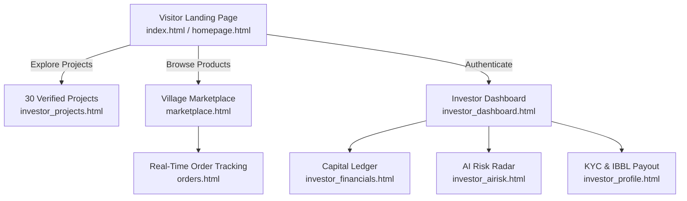

# 🌾 GramBandhan (গ্রামীণ বন্ধন) — Investor & Marketplace Ecosystem
### Module Codebase & Research Implementation Directory
**Author / Module Lead**: Shamia Akhter Tasfi ([@Tasfi21](https://github.com/Tasfi21))  
**Academic Team**: Team TORONGO_DHARA  
**Assigned Scope**: Landing Page & Hero Section, Investor Ecosystem (Dashboard, 30 Projects, Financial Ledger, AI Risk, Profile), Village Marketplace, Order Tracking, and Bondhon AI Chatbot.

---

## 🏛️ Module Overview & Supervisor Summary

This directory contains the complete source code, stylesheets, templates, and TypeScript client controllers authored and maintained by **Shamia Akhter Tasfi** for the **GramBandhan** Rural Agri-FinTech and Ethical Commerce Platform.

The subsystem empowers conscious global investors to discover, evaluate, and fund vetted rural Bangladeshi farming cohorts and women artisan collectives under fair **Shariah-compliant Mudarabah** (profit-and-loss sharing) contracts without interest (*Riba*).

---

## 📂 Complete File Inventory & Route Map

Every file in this folder was engineered for rapid supervisor evaluation and modular maintainability:

| View / File | Route Path | Core Engineering Responsibilities | Key Supervisor Demo Points |
| :--- | :--- | :--- | :--- |
| **`index.html`** / **`homepage.html`** | `/` or `/homepage.html` | Hero 2.0s crossfade carousel, Halal Investment spotlight, SDG impact cards, GIS telemetry preview | Fast 2.0s transition, dual pill CTAs, full responsiveness |
| **`investor_dashboard.html`** | `/investor_dashboard.html` | Dark Forest Green (`#02221A`) executive investor hub, portfolio summary cards, live harvest feeds | 4 primary metric cards (৳4,85,000 balance, ৳84,250 profit) |
| **`investor_projects.html`** | `/investor_projects.html` | 30 verified agricultural campaigns across 8 administrative divisions of Bangladesh | Interactive **Investment Return Calculator** (Mudarabah 65/35) |
| **`investor_financials.html`** | `/investor_financials.html` | Redesigned **2×2 Compact Capital Outflow & Return Inflow Ledger** | GAAP double-entry consistency, milestone release stages |
| **`investor_airisk.html`** | `/investor_airisk.html` | Predictive AI crop yield simulation, satellite precipitation radar, automated weather alerts | Real-time radar visualizer and flood risk scoring |
| **`investor_profile.html`** | `/investor_profile.html` | Verified NID profile, IBBL Mudarabah bank account configuration, bKash/Nagad payout wallets | Security session logs, Shariah compliance certifications |
| **`investor.html`** | `/investor.html` | Post-login investor welcome portal with curated opportunities and filter chips | One-click access to all investor sub-tabs |
| **`marketplace.html`** / **`market.html`** | `/marketplace.html` | Rural village marketplace showcasing 100 authentic Bangladeshi products priced in ৳ | Real-time search autocomplete, category filter chips, cart drawer |
| **`orders.html`** | `/orders.html` | Multi-stage live package tracking for agricultural orders | In-transit timeline steps, carrier details, SMS tracking alerts |
| **`login.html`** & **`register.html`** | `/login.html` | Role-based authentication modal with 1-Click Demo Login bypass | Instant evaluator login with prefilled credentials |
| **`projects.html`** | `/projects.html` | Public standalone directory of active agricultural investment cohorts | Category filters (Crops, Fisheries, Dairy, Poultry) |

---

## 🎨 Modular Stylesheet Architecture (`css/`)

The styling is organized into clean, modular CSS files adhering to standard CSS Custom Properties:

- **`css/investor.css`**: Master investor theme tokens, dark fintech palette (`#02221A`, `#061D15`, `#10B981`).
- **`css/investor_dashboard.css`**: Sidebar layout, grid container, metric cards, and responsive rail.
- **`css/investor_projects.css`**: Project cards, risk tier badges, funding progress bars, and calculator modal.
- **`css/investor_financials.css`**: Compact 2×2 ledger grid, outflow/inflow tables, and audit badges.
- **`css/investor_airisk.css`**: Weather radar canvases, satellite telemetry dials, and risk gauges.
- **`css/investor_profile.css`**: Form inputs, KYC status badges, IBBL bank cards, and security toggles.
- **`css/marketplace.css`**: Product cards, search autocomplete dropdown, cart sidebar, and checkout drawer.
- **`css/hero-section.css`**: Continuous crossfade banner, typography overlay, and banner dots.
- **`css/homepage.css`**: Section containers, Halal spotlight cards, and SDG impact grid.
- **`css/base.css`**: Core typography (Plus Jakarta Sans & Tiro Bangla), variables, and utility resets.
- **`css/style.css`**: Master consolidated bundle.

---

## ⚡ TypeScript Client Logic (`src/`)

- **`src/investor-profile.ts`**: Comprehensive controller powering all 6 tabs of the investor portal.
- **`src/marketplace.ts`**: Client-side state manager for 100 products, cart items, search autocomplete, and checkout.
- **`src/chatbot.ts`**: Bilingual (Bangla & English) Bondhon AI financial conversational agent.
- **`src/gnss-map.ts`**: Interactive Bangladesh district map visualizer displaying farming cohorts.
- **`src/active-projects.ts`**: Data loaders and filter handlers for 30 agricultural projects.
- **`src/data.ts`**: Complete seed dataset for projects, farmer profiles, products, and ledger transactions.
- **`src/auth.ts`**: Authentication state management, demo accounts, and session tokens.
- **`src/main.ts`**: Root orchestrator initializing modals, sliders, and navigation.

---

## 🧮 Mathematical Formulation: Mudarabah 65/35 Profit Sharing

In traditional microfinance, Bangladeshi smallholders are subjected to fixed compound interest (often exceeding 25–40% effective APR), leading to severe debt entrapment during seasonal flooding or crop failure.

Under Tasfi's Mudarabah engine implemented in `investor_projects.ts` and `investor-profile.ts`:

$$R_{\text{investor}} = C \times \left(1 + \frac{P_{\text{net}} \times 0.35}{C_{\text{cohort}}}\right)$$

- **Farmer Collective (Mudarib)**: Retains **65%** of all net harvest profits as the entrepreneur/producer share.
- **Capital Provider (Rab-al-Mal)**: Receives **35%** proportional to their capital contribution.
- **Capital Risk Guarantee**: In the event of catastrophic climate loss (*Jawa'ih*), capital loss is absorbed by capital providers while the farmer forfeits labor, preserving human dignity and preventing rural debt cycles.

---

## 🧪 Supervisor Evaluation Quick Guide

1. **Direct Launch**:
   Run `npm run dev` and navigate to:
   - Root Entrypoint: [http://localhost:5173/](http://localhost:5173/)
   - Dedicated Tasfi Route: [http://localhost:5173/Tasfi_Investor_Homepage_Market/index.html](http://localhost:5173/Tasfi_Investor_Homepage_Market/index.html)
   - Investor Dashboard: [http://localhost:5173/Tasfi_Investor_Homepage_Market/investor_dashboard.html](http://localhost:5173/Tasfi_Investor_Homepage_Market/investor_dashboard.html)
   - Village Marketplace: [http://localhost:5173/Tasfi_Investor_Homepage_Market/marketplace.html](http://localhost:5173/Tasfi_Investor_Homepage_Market/marketplace.html)
2. **1-Click Authentication**:
   Click **Demo Login** on any login screen or append `?sso=1` to immediately access verified states.
3. **Interactive Viva Test**:
   - Open **Investor Projects** (`investor_projects.html`), click **Calculate Return** on any project (e.g., *PRJ-2401 Bogura Potato*), slide investment amount from ৳5,000 to ৳50,000, and observe the live recalculation of the 35% investor dividend.
   - Open **AI Risk Analysis** (`investor_airisk.html`) to review satellite precipitation forecasts and soil moisture telemetry.
   - Open **Marketplace** (`marketplace.html`), search for "Honey", add items to bag, and view the checkout summary in Bangladeshi Taka (৳).

---

*Authored by Shamia Akhter Tasfi ([@Tasfi21](https://github.com/Tasfi21)) for University Capstone Defense & Research Presentation.*
