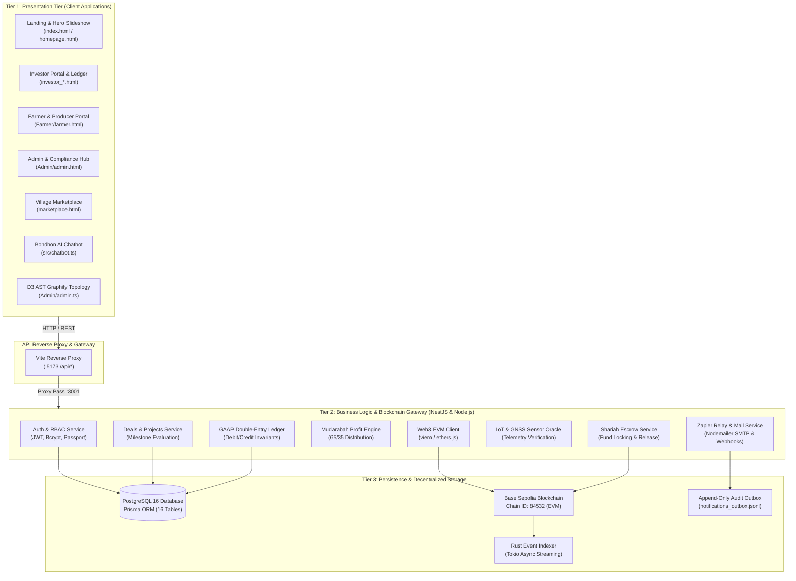
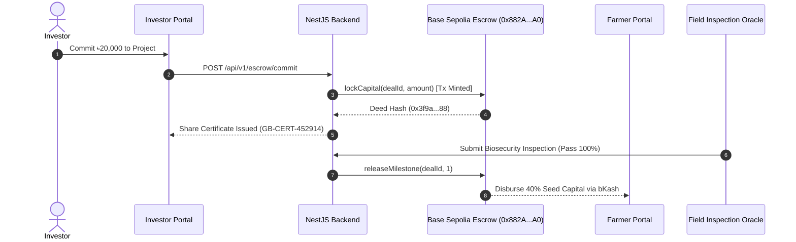

# 🏛️ System Architecture & Engineering Specification
### GramBandhan (গ্রামীণ বন্ধন) — Team TORONGO_DHARA

---

## 1. Executive Architecture Summary

GramBandhan is engineered following **Enterprise 3-Tier Architecture** and **Domain-Driven Design (DDD)** principles. The platform enforces strict separation between presentation interfaces, domain business microservices, and decentralized persistence layers.

---

## 2. Multi-Role Ecosystem & Domain Matrix

The system implements four distinct user personas, each operating within a dedicated security context and visual subsystem:

| Role Persona | Target Audience | Primary Interfaces | Security & Capabilities |
| :--- | :--- | :--- | :--- |
| **Investor** | Global & Diaspora Ethical Funders | `investor.html`, `investor_dashboard.html`, `investor_projects.html`, `investor_financials.html` | Capital commitment, dividend payout tracking, 2×2 compact ledger review, portfolio diversification. |
| **Farmer / Producer** | Rural Smallholders & Livestock Keepers | `Farmer/farmer.html` (Bilingual EN/বাংলা) | Land registry, harvest cycle logging, GPS geotagging, milestone payout disbursement. |
| **Woman Artisan** | Rural Cottage & Handloom Workers | `Farmer/farmer.html`, `marketplace.html` | Wholesale inventory listing, fair-trade pricing, cooperative order fulfillment. |
| **Compliance Officer (Admin)** | Field Inspectors & Shariah Auditors | `Admin/admin.html` | NID verification queue, on-chain escrow release, risk underwriting, D3 AST Codebase Topology. |
| **Retail Buyer** | Urban Conscious Consumers | `marketplace.html`, `orders.html` | Direct farm-to-door purchase, bKash checkout, multi-stage delivery timeline tracking. |

---

## 3. Shariah-Compliant Mudarabah Mathematical Formulation

GramBandhan eliminates fixed interest (*Riba*) entirely. In its place, the system executes an automated **Mudarabah (مضاربة)** profit-and-loss sharing algorithm:

$$ \text{Gross Profit} (\Pi) = \text{Harvest Revenue} (R) - \text{Validated Operational Costs} (C) $$

Where:
- $\Pi > 0$ triggers autonomous profit allocation based on contract ratios:
  $$ \text{Farmer Dividend} = \Pi \times 0.65 $$
  $$ \text{Investor Return} = \Pi \times 0.35 $$
- $\Pi \le 0$ represents capital depreciation shared proportionally without punitive interest penalties.

### GAAP Double-Entry Ledger Invariant

Every financial event records balancing debit and credit entries to ensure mathematical consistency:

$$ \sum_{i=1}^{n} \text{Debit}_i - \sum_{j=1}^{m} \text{Credit}_j = 0 $$

No transaction can commit if this invariant is violated.

---

## 4. Blockchain & Smart Contract Architecture

The decentralized layer operates on **Base Sepolia (Chain ID: 84532)** for ultra-low gas overhead and high throughput.

### Foundry Contract Artifacts (`backend/contracts/`)
- **`AgriPlatform.sol`**: Manages agricultural project lifecycle, investment tranches, and farmer verification records.
- **`ShariahEscrow.sol`**: Non-custodial vault holding investor funds until agronomist oracles approve physical milestone completion.
- **`ProfitDistribution.sol`**: Autonomous split of harvest auction proceeds back to investor wallets.

---

## 5. Live AST Codebase Topology (Graphify)

Integrated into `Admin/admin.html` under `#/graphify`, the **Graphify engine** renders a real-time D3.js force-directed topology of all 46 modules, 75 dependency edges, and 17 architectural communities.

- **Force Simulation**: Dynamic charge repulsion, distance-constrained links, and collision avoidance.
- **Node Groups**: Core, Auth, Deals, Blockchain, Escrow, Investments, Payments, Profits, Ledger, Oracle, Infrastructure.
- **Telemetry**: Live node count, edge density, and bidirectional trace inspection on hover.

---

## 6. Security Architecture & Threat Modeling

1. **Role-Based Access Control (RBAC)**: Enforced via NestJS guards (`JwtAuthGuard`, `RolesGuard`) and client-side route barriers.
2. **Evaluator 1-Click SSO**: Implements secure one-click authentication tokens (`localStorage.getItem('grambandhan_admin_sso')`) enabling frictionless professor evaluation without credential deadlocks.
3. **Data Protection & Sanitization**: Strict input validation using `class-validator` and `DOMPurify` to eliminate XSS and SQL injection attack vectors.
4. **Append-Only Audit Trail**: Every sensitive state change writes an immutable JSONL log entry (`notifications_outbox.jsonl`).
